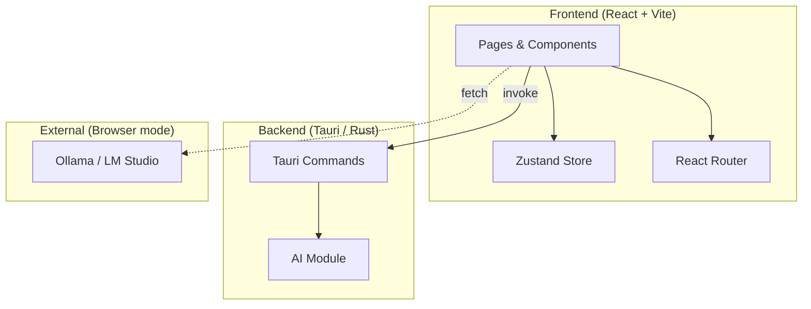
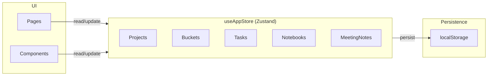
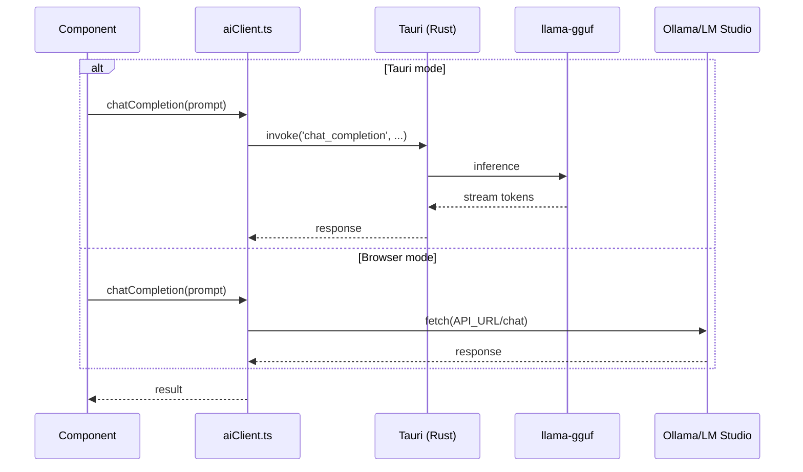
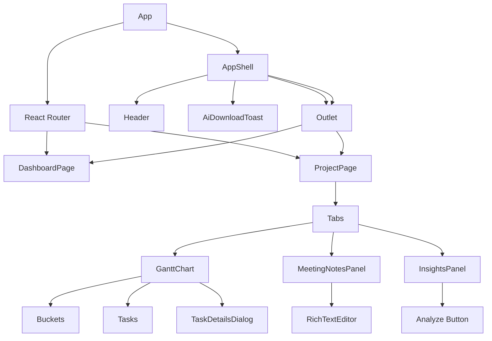
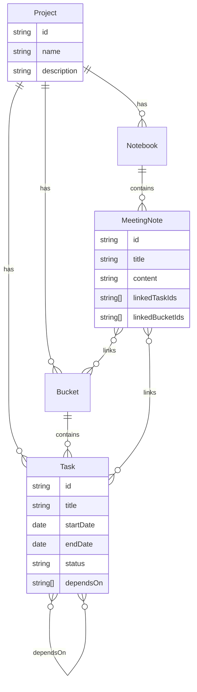
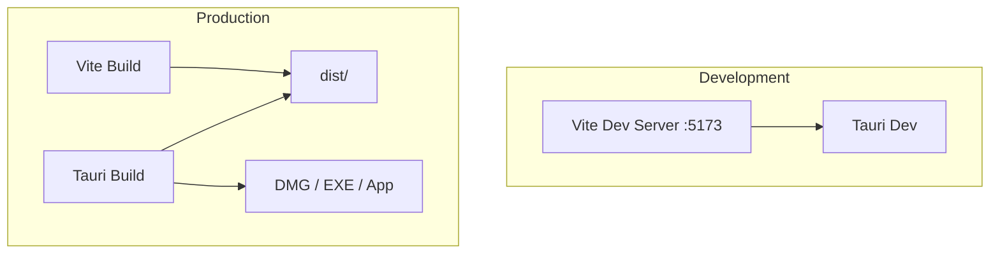

# NexusPM — Architecture

## High-Level Overview

NexusPM is a **Tauri 2** desktop application: a React frontend served inside a Rust-native window, with an optional embedded AI backend. The frontend can also run standalone in the browser, using external AI services (Ollama, LM Studio).



---

## Project Structure

```
NexusPM/
├── src/                          # Frontend (React + TypeScript)
│   ├── main.tsx                  # Entry point, theme init
│   ├── App.tsx                   # Router, route definitions
│   ├── app/
│   │   └── AppShell.tsx          # Layout, header, toast, Tauri listeners
│   ├── pages/
│   │   ├── DashboardPage.tsx      # Dashboard
│   │   └── ProjectPage.tsx      # Project tabs (Timeline, Notebook, Insights)
│   ├── components/
│   │   ├── AiDownloadToast.tsx   # Download progress toast (Tauri)
│   │   ├── SettingsDialog.tsx    # Settings, AI config, model download
│   │   ├── gantt/                # Gantt chart components
│   │   ├── insights/             # AI insights panel
│   │   ├── notes/                # Meeting notes, rich text editor
│   │   ├── task/                 # Task details dialog
│   │   ├── bucket/               # Bucket details dialog
│   │   └── ui/                   # Radix-based UI primitives
│   ├── store/
│   │   ├── useAppStore.ts        # Main app state (Zustand + persist)
│   │   ├── useAiStore.ts         # AI status (download, loading)
│   │   └── seed.ts               # Initial seed data
│   ├── lib/
│   │   ├── aiClient.ts           # AI API (Tauri invoke vs fetch)
│   │   ├── insightsContext.ts    # Build project context for AI
│   │   ├── linkifyInsights.tsx   # Clickable links in insights
│   │   └── ...
│   └── domain/
│       ├── types.ts              # Project, Task, Bucket, MeetingNote, etc.
│       └── stats.ts              # Progress, deadlines, blocked tasks
│
└── src-tauri/                    # Backend (Rust + Tauri)
    ├── src/
    │   ├── lib.rs                # Tauri setup, command registration
    │   ├── main.rs               # Entry point
    │   └── ai.rs                # Embedded AI (llama-gguf, download, inference)
    ├── Cargo.toml
    ├── tauri.conf.json
    ├── capabilities/default.json
    └── icons/
```

---

## Data Flow

### State Management



- **useAppStore** — Single source of truth for projects, buckets, tasks, notebooks, meeting notes. Persisted to `localStorage` under `nexuspm:data:v1`.
- **useAiStore** — AI-related state: download progress, loading, errors, `tauriDetected`, `downloadCancellable`. Not persisted.

### AI Request Flow



---

## Component Hierarchy



---

## Tauri Integration

### Commands (Rust → Frontend)

| Command | Purpose |
|---------|---------|
| `chat_completion` | Run inference with embedded model |
| `ai_model_status` | Check if model is downloaded/loaded |
| `download_ai_model` | Start model download |
| `start_background_download` | Start download with progress events |
| `request_download_cancel` | Pause or stop download |
| `resume_background_download` | Resume paused download |

### Events (Rust → Frontend)

| Event | Payload | Purpose |
|-------|---------|---------|
| `ai:download-started` | `{ cancellable }` | Download began |
| `ai:download-progress` | `{ bytes, total }` | Progress update |
| `ai:download-completed` | — | Download finished |
| `ai:load-started` | — | Model loading |
| `ai:load-completed` | — | Model ready |

### Frontend Detection

The app detects Tauri via:

1. `window.__TAURI__` / `__TAURI_INTERNALS__` / `__TAURI_METADATA__`
2. Fallback: `invoke('ai_model_status')` on mount — success implies Tauri

---

## Domain Model



---

## Build & Runtime



- **Development**: `npm run tauri:dev` — Vite serves the frontend; Tauri loads it in a native window.
- **Production**: `npm run tauri:build` — Vite builds to `dist/`; Tauri bundles the app (macOS DMG, Windows EXE, etc.).
