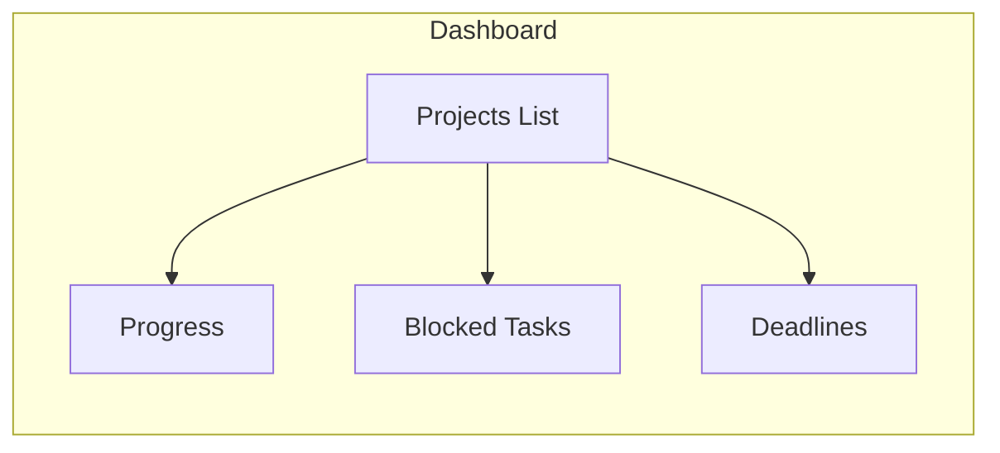
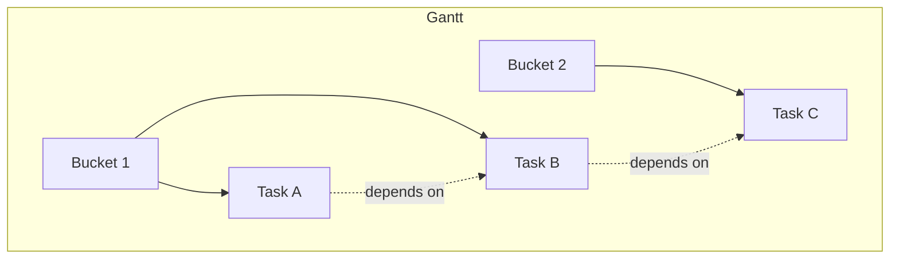
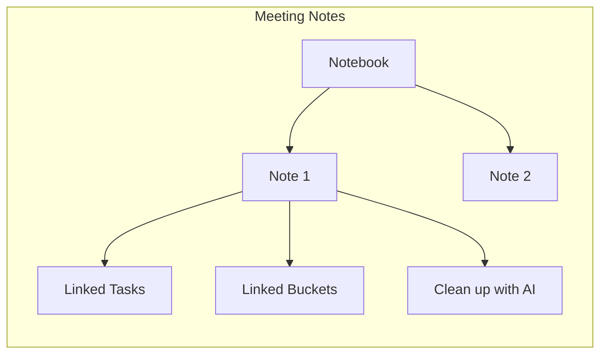
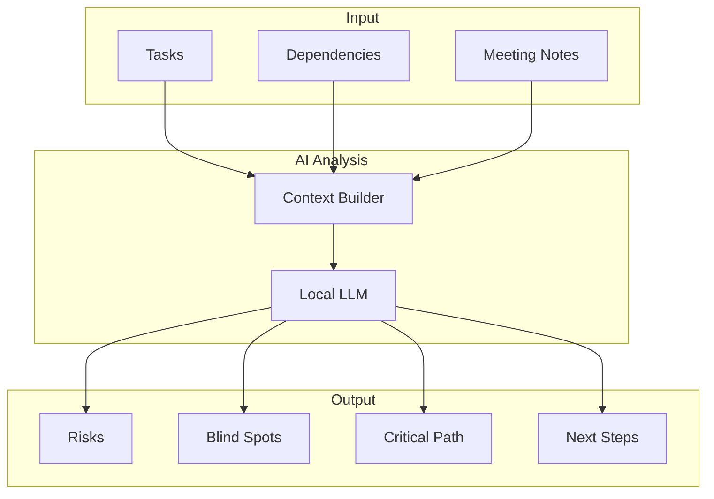
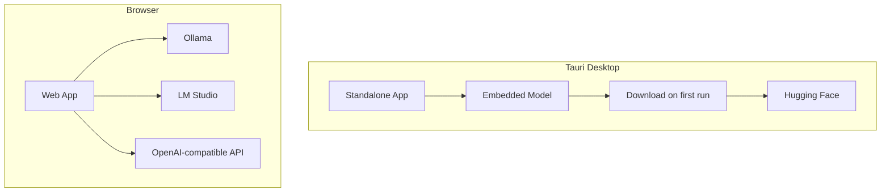

# NexusPM — Purpose & Functionalities

## Overview

**NexusPM** is a project management desktop application that combines traditional project planning (Gantt charts, tasks, buckets) with AI-powered analysis and meeting note automation. It runs as a standalone Tauri app with an embedded local AI model, or in the browser with Ollama/LM Studio.

---

## Core Purpose

NexusPM helps teams and individuals:

1. **Plan** — Organize work in buckets, schedule tasks on a Gantt timeline, and define dependencies
2. **Document** — Capture meeting notes with rich text, linked to tasks and buckets
3. **Analyze** — Use local AI to surface risks, blind spots, critical path, and next steps
4. **Automate** — Clean up raw meeting notes into structured takeaways, PTAs, and timelines

All data stays local. AI runs on your machine—no cloud API keys required for the desktop build.

---

## Main Functionalities

### 1. Dashboard

The home view provides a high-level overview:

- List of all projects
- Progress indicators
- Blocked tasks
- Upcoming deadlines

---

### 2. Gantt Timeline

Visual project planning with drag-and-drop scheduling:

| Feature | Description |
|---------|-------------|
| **Buckets** | Groups for organizing tasks (phases, teams, workstreams) |
| **Tasks** | Items with start/end dates, status, owner, color |
| **Dependencies** | Task-to-task links; blocking detection for overdue/blocked status |
| **Drag to reschedule** | Move tasks on the timeline to adjust dates |
| **Task details** | Click a task to edit title, dates, status, description, dependencies |
| **Bucket details** | Edit bucket name, description, owner |

---

### 3. Meeting Notes

Rich-text notebooks linked to projects:

- **Notebooks** — Multiple notebooks per project (e.g. weekly standups, sprint reviews)
- **Rich text** — Bold, italic, headings, tables, links (TipTap editor)
- **Links** — Associate notes with tasks and buckets
- **Clean up with AI** — Turn raw notes into structured takeaways, next steps, PTAs, timelines

---

### 4. AI Insights

The **Insights** tab analyzes project data and returns:

- **Risks** — Potential issues (blocked tasks, overdue items, dependency chains)
- **Blind spots** — Gaps or missing information
- **Critical path** — Key tasks that drive the timeline
- **Next steps** — Recommended actions

---

### 5. Import / Export

- **Export** — Download all data as JSON
- **Import** — Restore from a previously exported JSON file

---

### 6. Settings

- **AI model configuration** — Base URL and model name (for browser/Ollama/LM Studio)
- **Download AI model** — Tauri app only: download the embedded model (~8.5GB) on first use

---

## User Flows

| Flow | Steps |
|------|-------|
| **Create project** | Dashboard → New project → Add buckets → Add tasks |
| **Plan timeline** | Timeline tab → Drag tasks → Set dependencies |
| **Document meetings** | Notebook tab → Create note → Add content → Link tasks/buckets |
| **Get AI insights** | Insights tab → Analyze → Review risks, blind spots, next steps |
| **Clean meeting notes** | Meeting note → "Clean up with AI" → Review structured output |

---

## Running Modes

| Mode | AI Source |
|------|-----------|
| **Tauri desktop** | Embedded Qwen2.5-Coder-14B (download on first AI request) |
| **Browser** | Ollama, LM Studio, or any OpenAI-compatible API |
