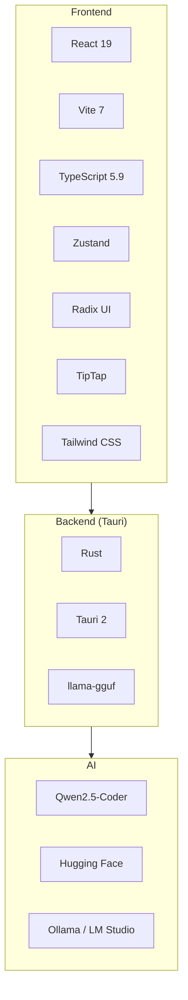
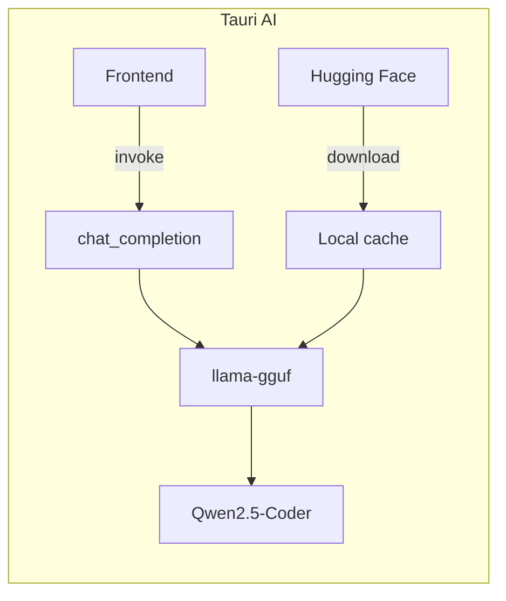
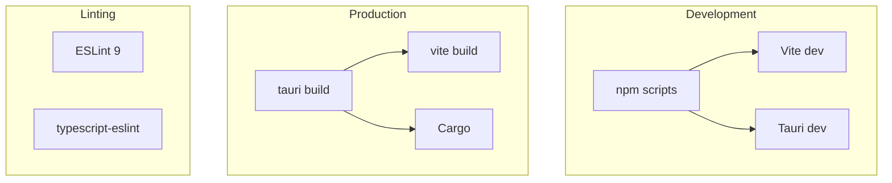
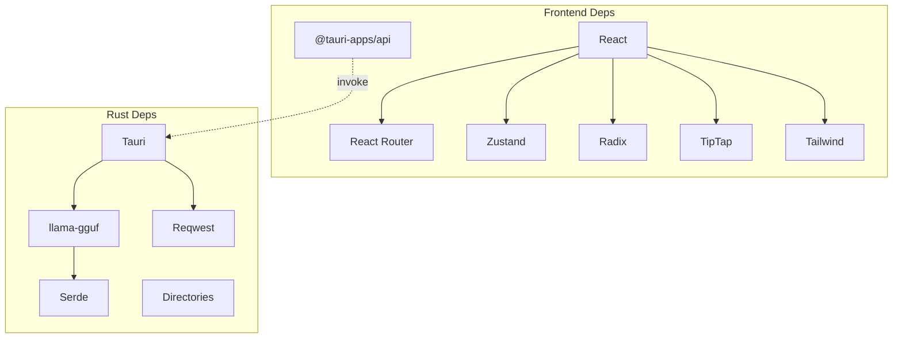

# NexusPM — Tech Stack

## Overview

---

## Frontend

### Core

| Technology | Version | Purpose |
|------------|---------|---------|
| **React** | 19.2 | UI framework |
| **React Router** | 7.13 | Client-side routing |
| **TypeScript** | 5.9 | Type safety |
| **Vite** | 7.3 | Dev server, bundling, HMR |
| **Zustand** | 5.0 | State management + persistence |

### UI & Styling

| Technology | Purpose |
|------------|---------|
| **Radix UI** | Alert Dialog, Dialog, Dropdown Menu, Separator, Slot, Tabs |
| **Tailwind CSS** | Utility-first styling |
| **@tailwindcss/typography** | Prose styles for rendered content |
| **lucide-react** | Icons |
| **class-variance-authority** | Component variants |
| **clsx** + **tailwind-merge** | Conditional class names |

### Rich Text & Content

| Technology | Purpose |
|------------|---------|
| **TipTap** | Rich text editor (Starter Kit, Link, Placeholder, Table) |
| **marked** | Markdown rendering (e.g. AI insights) |

### Utilities

| Technology | Purpose |
|------------|---------|
| **date-fns** | Date formatting, manipulation |
| **nanoid** | Unique IDs for entities |

---

## AI

### Tauri (Embedded)

| Technology | Version | Purpose |
|------------|---------|--------|
| **llama-gguf** | 0.13 | Local inference (CPU, Hugging Face) |
| **Qwen2.5-Coder-14B-Q4_K_M** | — | Default model (~8.5GB) |
| **Hugging Face** | — | Model download, caching |
| **reqwest** | 0.12 | HTTP client (blocking, rustls) |

### Browser (External)

| Service | Purpose |
|---------|---------|
| **Ollama** | Local LLM server |
| **LM Studio** | Local LLM server with UI |
| **OpenAI-compatible API** | Any compatible endpoint |

---

## Backend (Tauri / Rust)

### Core

| Crate | Version | Purpose |
|-------|---------|---------|
| **tauri** | 2.10 | Desktop app framework |
| **tauri-build** | 2.5 | Build-time integration |
| **tauri-plugin-log** | 2 | Logging |

### AI & I/O

| Crate | Version | Purpose |
|-------|---------|---------|
| **llama-gguf** | 0.13 | GGUF model loading, inference |
| **reqwest** | 0.12 | HTTP (blocking, rustls-tls) |
| **serde** / **serde_json** | 1.0 | Serialization |
| **directories** | 5.0 | App data paths |
| **log** | 0.4 | Logging |

### llama-gguf features

- `cpu` — CPU inference
- `huggingface` — Hugging Face client for model download

---

## Build & Tooling

### Scripts

| Script | Command | Purpose |
|--------|---------|---------|
| `dev` | `vite` | Web dev server (browser only) |
| `build` | `tsc --noEmit && vite build` | Frontend production build |
| `tauri:dev` | `tauri dev` | Desktop app development |
| `tauri:build` | `tauri build` | Desktop app production build |
| `tauri:build:win` | `tauri build --target x86_64-pc-windows-gnu` | Windows cross-compile |

### Linting

| Tool | Version | Purpose |
|------|---------|---------|
| **ESLint** | 9.x | Linting |
| **typescript-eslint** | 8.x | TypeScript rules |
| **eslint-plugin-react-hooks** | 7 | React Hooks rules |
| **eslint-plugin-react-refresh** | 0.4 | Fast Refresh |

---

## Dependency Diagram

---

## Version Summary

| Layer | Key Versions |
|-------|--------------|
| **Node** | — |
| **Rust** | 1.77.2 |
| **React** | 19.2 |
| **Vite** | 7.3 |
| **Tauri** | 2.10 |
| **TypeScript** | 5.9 |
| **llama-gguf** | 0.13 |
